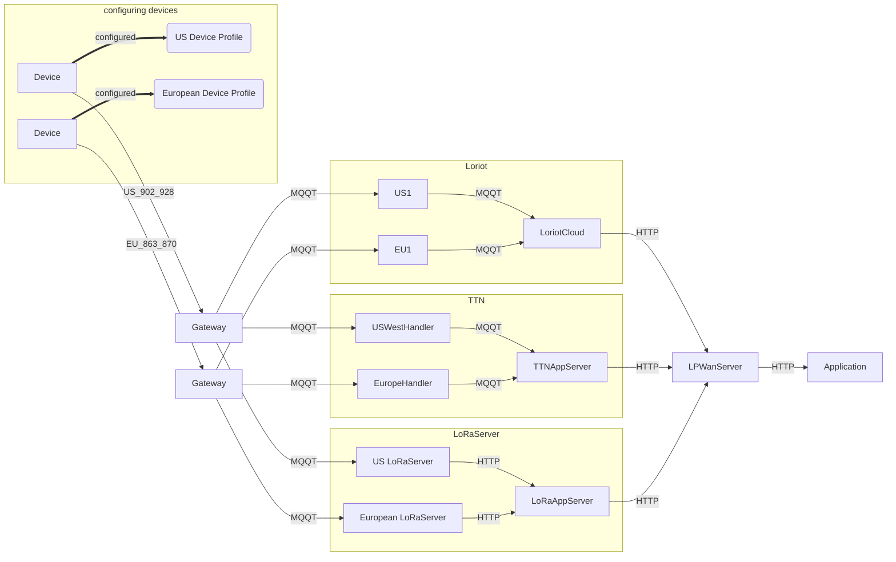
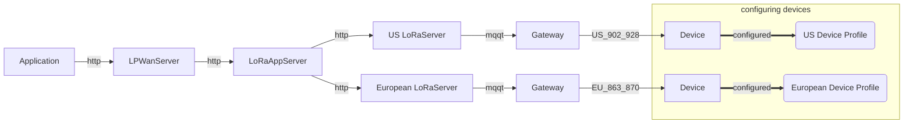
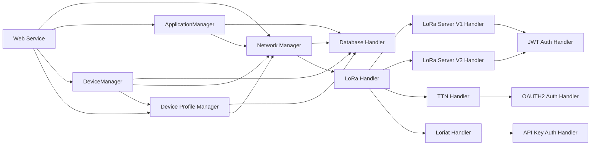
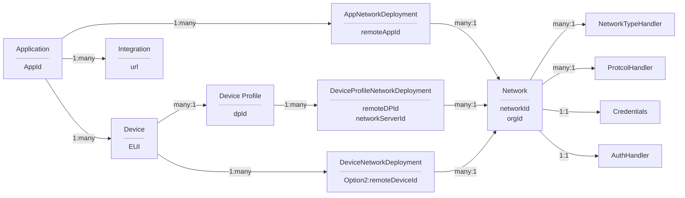

## API Design Principles

- A manager is reponsible for tasks maininly in their area (e.g. DeviceManager for Device operations)
- API should be built to easy port to micro services
- All DB specific formats/operations should be behind the DB Handler (e.g. SQL versus NoSQL queries formats) 
- Operations should be done through CRUD operations as much as possible.  So use flags and PUTS rather than /api/resourse/:id/operation 

## System Architecture

### Uplink LoRa Server

### Downlink LoRa Server

## LPWanServer Design

## Data Model

