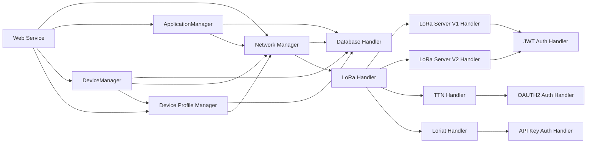
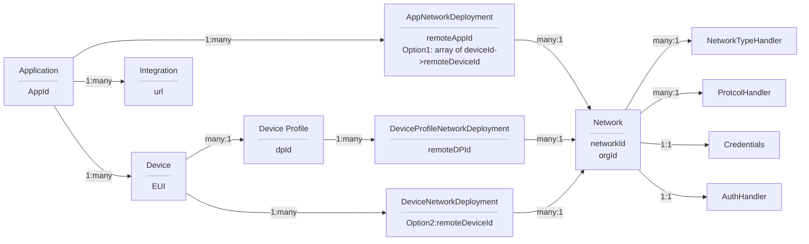

# LPWanServer Design

```mermaid
graph LR
WS[Web Service]
AM[ApplicationManager]
DM[DeviceManager]
DPM[Device Profile Manager]
NM[Network Manager]

DB[Database Handler]
LH[LoRa Handler]
LSV1[LoRa Server V1 Handler]
LSV2[LoRa Server V2 Handler]
TTN[TTN Handler]
LR[Loriat Handler]

JWT[JWT Auth Handler]
OAUTH2[OAUTH2 Auth Handler]
AK[API Key Auth Handler]

WS --> NM
WS --> AM
WS --> DM
WS --> DPM
AM --> DB
DM --> DB
DPM --> DB
NM --> DB

AM --> NM
DM --> NM
DPM --> NM

DM --> DPM

NM --> LH
LH --> LSV1
LH --> LSV2
LH --> TTN
LH --> LR

LSV1 --> JWT
LSV2 --> JWT
TTN --> OAUTH2
LR --> AK


```

# Data Model

```mermaid
graph LR
A[Application<hr>AppId] 
B[Device<hr>EUI]
C[Device Profile<hr>dpId]
D[AppNetworkDeployment<hr>remoteAppId<br>Option1: array of deviceId->remoteDeviceId]
E[Network<hr>networkId<br>orgId]
G[DeviceProfileNetworkDeployment<hr>remoteDPId]
H[Integration<hr>url]
I[NetworkTypeHandler]
J[ProtcolHandler]
K[DeviceNetworkDeployment<hr>Option2:remoteDeviceId]
L[Credentials]
M[AuthHandler]
A --> |1:many|B
A --> |1:many|H
B --> |many:1|C
A --> |1:many| D
D --> |many:1| E
C --> |1:many| G
G --> |many:1| E
E --> |many:1| I
E --> |many:1| J
B --> |1:many| K
K --> |many:1| E
E --> |1:1| L
E --> |1:1| M
```

