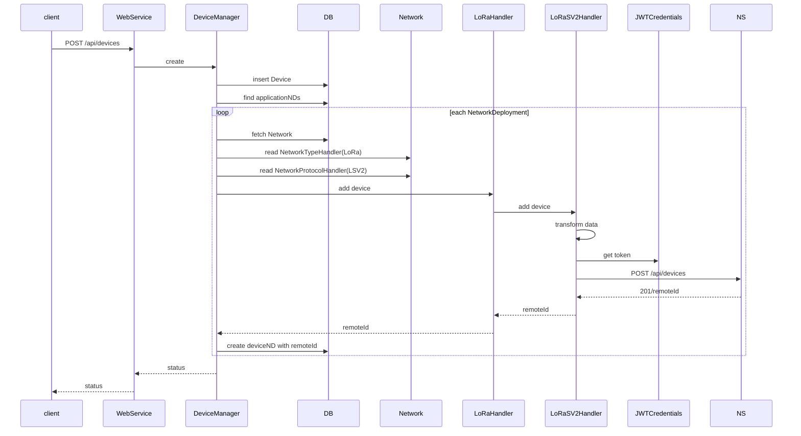
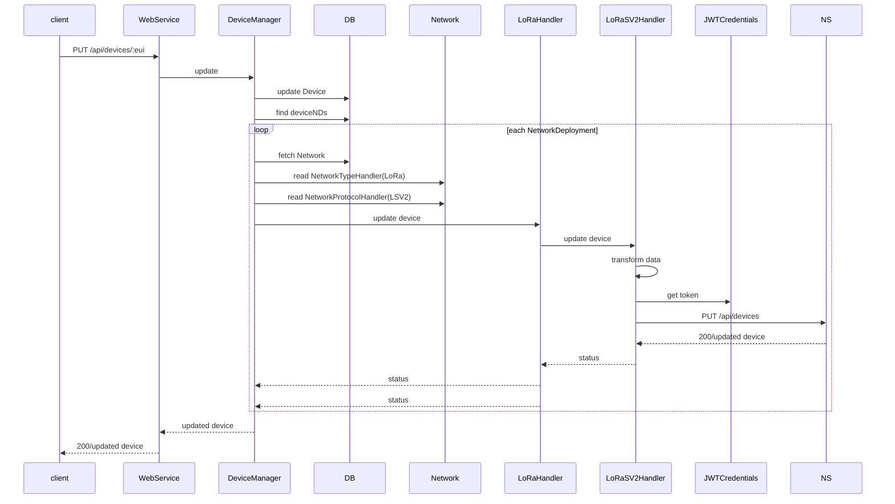
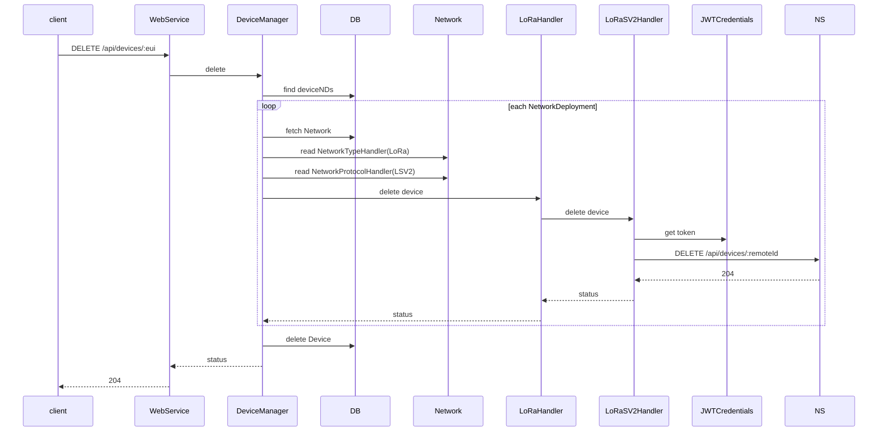

# Device

## Notes and Ideas

- EUI should form the key for Devices

## API and Data Shape

### Create Device

```http
POST /api/devices
```

Body

```json
{
    "deviceEUI": "string",
    "name": "string",
    "description": "deviceDescription",
    "applicationId": "string",
    "deviceProfileId": "string",
    "skipFrameCounterCheck": "boolean",
    "referenceAltitude": "number"
}
```

Returns 201

```json
{}
```

### Get Device

1. Do we want to return the network information with the device
2. If so does this impact Option 1 or 2 design?

```http
GET /api/devices/:eui
```

Returns 200

```json
{
    "deviceEUI": "string",
    "name": "string",
    "description": "deviceDescription",
    "applicationId": "string",
    "deviceProfileId": "string",
    "skipFrameCounterCheck": "boolean",
    "referenceAltitude": "number",
    "deviceStatusBattery": "number",
    "deviceStatusMargin": "number",
    "lastSeenAt": "date",
    "location": {
    	"accuracy": "number",
    	"altitude": "number",
    	"latitude": "number",
    	"longitude": "number",
    	"source": "string"
    },
    "networkDeployment": [
        {
            networkId: "string",
            remoteDeviceId: "string"
        }
    ]
}
```

### Get Many Devices

```http
GET /api/devices?query=q
```

Returns 200

```json
{
  "returned": "number",
  "available": "number",
  "results": [
    {
        "deviceEUI": "string",
        "name": "string",
        "description": "deviceDescription",
        "applicationId": "string",
        "deviceProfileId": "string",
        "skipFrameCounterCheck": "boolean",
        "referenceAltitude": "number",
        "deviceStatusBattery": "number",
        "deviceStatusMargin": "number",
        "lastSeenAt": "date"
    }]
}
```

### Get an Application's Devices

```http
GET /api/applications/:id/devices?query=q
```

Returns 200

```json
{
  "returned": "number",
  "available": "number",
  "results": [
    {
        "deviceEUI": "string",
        "name": "string",
        "description": "appDescription",
        "applicationId": "string",
        "deviceProfileId": "string",
        "skipFrameCounterCheck": "boolean",
        "referenceAltitude": "number",
        "deviceStatusBattery": "number",
        "deviceStatusMargin": "number",
        "lastSeenAt": "date"
    }]
}
```


### Update Device

```http
PUT /api/devices/:eui
```

Body

```json
{
  	"deviceEUI": "string",
    "name": "string",
    "description": "deviceDescription",
    "applicationId": "string",
    "deviceProfileId": "string",
    "skipFrameCounterCheck": "boolean",
    "referenceAltitude": "number"
}
```

Return 200

```json
{
    "deviceEUI": "string",
    "name": "string",
    "description": "deviceDescription",
    "applicationId": "string",
    "deviceProfileId": "string",
    "skipFrameCounterCheck": "boolean",
    "referenceAltitude": "number",
    "deviceStatusBattery": "number",
    "deviceStatusMargin": "number",
    "lastSeenAt": "date"
}
```


### Delete Device

```http
DELETE /api/devices/:id
```

Body

```json
{}
```

Return 204

```JSON
{}
```

## Proposed Flow

### New Device 

*Note: Used LoRaServerV2 as an example, could be any protocol*

Question:  Do we want to use Appliaction to managae the networkDeployments or use them directly?




### Update Device 

*Note: Used LoRaServerV2 as an example, could be any protocol*


### Get Device 

```sequence
client->WebService: GET\n/api/devices/:id
WebService->DeviceManager: fetch
DeviceManager->DB: findById Device
DeviceManager-->WebService: Device
WebService-->client: Device
```
### Delete Device 



